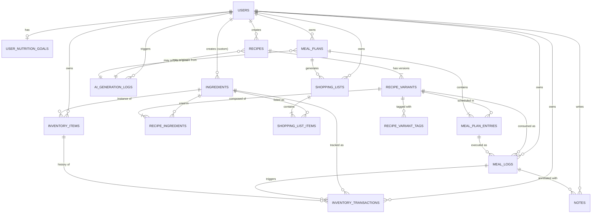

# MealForge — Database Schema Design (ERD)

> Week 1 产出。本文档定义 MVP 阶段（Week 1-4）与 Phase 2（Week 5+）的数据库 schema。
> 任何 schema 变更必须更新本文档，并通过 Alembic migration 落地。

---

## Overview

MealForge 采用 PostgreSQL 作为主数据库。核心实体围绕**用户营养目标 → 菜谱（含变体） → 餐食计划 → 实际执行 → 库存联动 → 采购**的闭环组织。

设计原则：

1. **规范化优先**：所有食材份量统一为克数；营养信息统一为 per 100g
2. **缓存聚合字段**：高频查询的聚合值（菜谱总营养）写入实体表，写入时同步更新
3. **事件流 + 快照双写**：库存采用 `InventoryItem`（当前快照）+ `InventoryTransaction`（变动日志）混合架构
4. **AI 调用全链路可观测**：所有 LLM 调用记录到 `AIGenerationLog`，菜谱可追溯生成来源
5. **演进式建模**：MVP 阶段尽量减少表数，Phase 2 演化时通过 migration 补足

---

## Entity Relationship Diagram



---

## Table Specifications

### Conventions

- 所有主键：`BIGSERIAL PRIMARY KEY`（自增 64 位整数）
- 所有表都有 `created_at TIMESTAMPTZ NOT NULL DEFAULT NOW()`
- 用户相关表都有 `updated_at TIMESTAMPTZ NOT NULL DEFAULT NOW()`，由触发器或 ORM 维护
- 软删除：MVP 不做，删除即物理删除（除非有审计需求）
- 时间字段全部 `TIMESTAMPTZ`（带时区），不用 `TIMESTAMP`
- 钱 / 营养值用 `NUMERIC(p, s)` 而非 `FLOAT`（避免精度丢失）

---

### 1. `users`

```sql
CREATE TABLE users (
    id              BIGSERIAL PRIMARY KEY,
    email           VARCHAR(255) NOT NULL UNIQUE,
    display_name    VARCHAR(100),
    
    -- 认证由 Clerk/Supabase 处理，这里只存外部 ID
    auth_provider_id VARCHAR(255) NOT NULL UNIQUE,
    
    -- 用户基础信息（用于 TDEE 计算）
    height_cm       NUMERIC(5, 2),
    weight_kg       NUMERIC(5, 2),
    age             INT,
    biological_sex  VARCHAR(10),         -- 'male' / 'female' / 'other'
    activity_level  VARCHAR(20),         -- 'sedentary' / 'light' / 'moderate' / 'active' / 'very_active'
    
    created_at      TIMESTAMPTZ NOT NULL DEFAULT NOW(),
    updated_at      TIMESTAMPTZ NOT NULL DEFAULT NOW()
);

CREATE INDEX idx_users_auth_provider_id ON users(auth_provider_id);
```

---

### 2. `user_nutrition_goals`

用户的目标营养摄入。一个用户一条（未来可扩展历史）。

```sql
CREATE TABLE user_nutrition_goals (
    id                 BIGSERIAL PRIMARY KEY,
    user_id            BIGINT NOT NULL UNIQUE REFERENCES users(id) ON DELETE CASCADE,
    
    goal_type          VARCHAR(20) NOT NULL,  -- 'fat_loss' / 'muscle_gain' / 'maintenance'
    
    -- 目标值（用户可覆盖系统计算结果）
    daily_calories     NUMERIC(7, 1) NOT NULL,
    daily_protein_g    NUMERIC(6, 1) NOT NULL,
    daily_carbs_g      NUMERIC(6, 1) NOT NULL,
    daily_fat_g        NUMERIC(6, 1) NOT NULL,
    
    is_custom          BOOLEAN NOT NULL DEFAULT FALSE,  -- 是否用户手动覆盖
    
    created_at         TIMESTAMPTZ NOT NULL DEFAULT NOW(),
    updated_at         TIMESTAMPTZ NOT NULL DEFAULT NOW()
);
```

---

### 3. `ingredients`

食材主表。归一化存储 per 100g 营养信息。

```sql
CREATE TABLE ingredients (
    id                 BIGSERIAL PRIMARY KEY,
    name               VARCHAR(200) NOT NULL,
    name_normalized    VARCHAR(200) NOT NULL,         -- 全小写去空格,用于搜索
    category           VARCHAR(50),                    -- 'vegetable' / 'meat' / 'dairy' / 'grain' / 'oil' / ...
    
    -- 营养（per 100g）
    per_100g_calories  NUMERIC(6, 1) NOT NULL,
    per_100g_protein   NUMERIC(5, 2) NOT NULL,
    per_100g_carbs     NUMERIC(5, 2) NOT NULL,
    per_100g_fat       NUMERIC(5, 2) NOT NULL,
    per_100g_fiber     NUMERIC(5, 2),
    
    -- UI 展示单位元数据(改良方案A的核心)
    default_unit       VARCHAR(20) NOT NULL DEFAULT 'g',  -- 'g' / 'ml' / '个' / '勺' / '杯'
    grams_per_unit     NUMERIC(7, 2) NOT NULL DEFAULT 1.0, -- 1 个该单位 = ? 克
    
    -- 保质期与来源
    shelf_life_days    INT,                            -- 标准保质期(天),用户库存条目可覆盖
    source             VARCHAR(20) NOT NULL DEFAULT 'user',  -- 'usda' / 'system' / 'user'
    usda_fdc_id        VARCHAR(20),                    -- USDA FoodData Central ID
    created_by_user_id BIGINT REFERENCES users(id) ON DELETE SET NULL,
    
    created_at         TIMESTAMPTZ NOT NULL DEFAULT NOW(),
    updated_at         TIMESTAMPTZ NOT NULL DEFAULT NOW()
);

CREATE INDEX idx_ingredients_name_normalized ON ingredients(name_normalized);
CREATE INDEX idx_ingredients_category ON ingredients(category);
CREATE INDEX idx_ingredients_source ON ingredients(source);
CREATE UNIQUE INDEX idx_ingredients_usda_fdc_id ON ingredients(usda_fdc_id) WHERE usda_fdc_id IS NOT NULL;
```

**关键设计**：

- `name_normalized` 用于模糊搜索（"番茄" vs "西红柿" 需要别名时未来加 `IngredientAlias` 表）
- `source='usda'` 全局共享，`source='user'` 私有（由 `created_by_user_id` 标识所有者）
- 用户在 UI 输入"2 个鸡蛋"→ 后端换算 `2 * grams_per_unit (50) = 100g` 存入 `RecipeIngredient.quantity_grams`

---

### 4. `recipes`

菜谱"概念层"，一道菜的标识。具体做法在 `recipe_variants`。

```sql
CREATE TABLE recipes (
    id                       BIGSERIAL PRIMARY KEY,
    name                     VARCHAR(200) NOT NULL,
    description              TEXT,
    cuisine                  VARCHAR(50),         -- 'chinese' / 'western' / 'japanese' / ...
    
    -- 来源追溯
    source                   VARCHAR(20) NOT NULL,  -- 'system' / 'user' / 'ai_generated'
    created_by_user_id       BIGINT REFERENCES users(id) ON DELETE SET NULL,
    ai_generation_log_id     BIGINT REFERENCES ai_generation_logs(id) ON DELETE SET NULL,
    
    -- 可见性
    is_public                BOOLEAN NOT NULL DEFAULT FALSE,  -- system 菜谱默认 true
    
    created_at               TIMESTAMPTZ NOT NULL DEFAULT NOW(),
    updated_at               TIMESTAMPTZ NOT NULL DEFAULT NOW()
);

CREATE INDEX idx_recipes_created_by ON recipes(created_by_user_id);
CREATE INDEX idx_recipes_source ON recipes(source);
CREATE INDEX idx_recipes_name ON recipes(name);
```

---

### 5. `recipe_variants`

一道菜的具体做法。同一个 Recipe 下可挂多个 Variant（经典版 / 减脂版 / 增肌版）。

```sql
CREATE TABLE recipe_variants (
    id                       BIGSERIAL PRIMARY KEY,
    recipe_id                BIGINT NOT NULL REFERENCES recipes(id) ON DELETE CASCADE,
    
    name                     VARCHAR(100) NOT NULL,    -- '经典版' / '减脂版' / '高蛋白版'
    purpose_tag              VARCHAR(30) NOT NULL DEFAULT 'default',
        -- 'default' / 'fat_loss' / 'muscle_gain' / 'stomach_friendly' / 'low_carb' / 'high_protein'
    extra_notes              TEXT,                     -- 用户自由备注
    
    instructions             TEXT NOT NULL,            -- 做法步骤(MVP用纯文本,Phase 2考虑 JSONB)
    cooking_time_minutes     INT,
    difficulty               VARCHAR(20),              -- 'easy' / 'medium' / 'hard'
    servings                 INT NOT NULL DEFAULT 1,   -- 该 variant 默认产出几人份
    
    -- 营养缓存(由 recipe_ingredients 聚合而来)
    total_calories           NUMERIC(7, 1),
    total_protein_g          NUMERIC(6, 2),
    total_carbs_g            NUMERIC(6, 2),
    total_fat_g              NUMERIC(6, 2),
    total_grams              NUMERIC(8, 2),
    nutrition_computed_at    TIMESTAMPTZ,
    
    created_at               TIMESTAMPTZ NOT NULL DEFAULT NOW(),
    updated_at               TIMESTAMPTZ NOT NULL DEFAULT NOW()
);

CREATE INDEX idx_recipe_variants_recipe_id ON recipe_variants(recipe_id);
CREATE INDEX idx_recipe_variants_purpose_tag ON recipe_variants(purpose_tag);
```

**关键设计**：

- 一个 Recipe **至少有一个 Variant**（创建 Recipe 时同步创建 `purpose_tag='default'` 的 variant）
- 营养字段缓存:任意 `recipe_ingredient` 变更时同步 / 异步重算
- `nutrition_computed_at` 用于排查缓存不一致
- `purpose_tag` 是**系统级固定枚举**（产品定义），用户的个性化标签走 `recipe_variant_tags` 表

---

### 6. `recipe_variant_tags`

用户自定义的自由标签。与 `purpose_tag` 互补：枚举管核心分类，自由标签管个性化（"过年版" / "老婆爱吃" / "露营快手"）。

```sql
CREATE TABLE recipe_variant_tags (
    id                       BIGSERIAL PRIMARY KEY,
    recipe_variant_id        BIGINT NOT NULL REFERENCES recipe_variants(id) ON DELETE CASCADE,
    
    tag                      VARCHAR(50) NOT NULL,        -- 写入前 lowercase + trim 规范化
    created_by_user_id       BIGINT REFERENCES users(id) ON DELETE SET NULL,
    
    created_at               TIMESTAMPTZ NOT NULL DEFAULT NOW()
);

CREATE INDEX idx_recipe_variant_tags_variant ON recipe_variant_tags(recipe_variant_id);
CREATE INDEX idx_recipe_variant_tags_tag ON recipe_variant_tags(tag);
CREATE UNIQUE INDEX idx_recipe_variant_tags_unique ON recipe_variant_tags(recipe_variant_id, tag);
```

**关键设计**：

- **写入时强制规范化**：业务层做 `tag = tag.strip().lower()`，避免 "减脂期 " vs "减脂期" 视为不同
- 同一 variant 同一 tag 唯一（UNIQUE 约束兜底）
- 删除 variant 级联删 tag（`ON DELETE CASCADE`）；删用户只置空 `created_by_user_id`（标签不消失）
- Phase 2 可以加 `tag` 字段的 GIN 索引支持快速"按 tag 找菜谱"

---

### 7. `recipe_ingredients`

菜谱变体与食材的关联表，存储份量（统一克数）。

```sql
CREATE TABLE recipe_ingredients (
    id                       BIGSERIAL PRIMARY KEY,
    recipe_variant_id        BIGINT NOT NULL REFERENCES recipe_variants(id) ON DELETE CASCADE,
    ingredient_id            BIGINT NOT NULL REFERENCES ingredients(id) ON DELETE RESTRICT,
    
    quantity_grams           NUMERIC(8, 2) NOT NULL,
    display_quantity         NUMERIC(7, 2),         -- 用户填的原始数量(展示用)
    display_unit             VARCHAR(20),           -- 用户填的原始单位(展示用)
    
    notes                    VARCHAR(200),          -- '切丁' / '去皮'
    sort_order               INT NOT NULL DEFAULT 0,
    
    created_at               TIMESTAMPTZ NOT NULL DEFAULT NOW()
);

CREATE UNIQUE INDEX idx_recipe_ingredients_variant_ingredient ON recipe_ingredients(recipe_variant_id, ingredient_id);
CREATE INDEX idx_recipe_ingredients_ingredient_id ON recipe_ingredients(ingredient_id);
```

**关键设计**：

- `quantity_grams` 是计算的唯一来源
- `display_quantity / display_unit` 仅作展示，保留用户原始输入（"2 个" / "1 勺"）以便 UI 还原

---

### 8. `meal_plans`

餐食计划聚合根。任意起止日期。

```sql
CREATE TABLE meal_plans (
    id                       BIGSERIAL PRIMARY KEY,
    user_id                  BIGINT NOT NULL REFERENCES users(id) ON DELETE CASCADE,
    
    name                     VARCHAR(100),                 -- '10月减脂周' / NULL(自动命名)
    start_date               DATE NOT NULL,
    end_date                 DATE NOT NULL,
    plan_type                VARCHAR(20) NOT NULL DEFAULT 'regular',  -- 'regular' / 'template' / 'special'
    is_template              BOOLEAN NOT NULL DEFAULT FALSE,
    
    -- AI 生成追溯
    ai_generation_log_id     BIGINT REFERENCES ai_generation_logs(id) ON DELETE SET NULL,
    
    created_at               TIMESTAMPTZ NOT NULL DEFAULT NOW(),
    updated_at               TIMESTAMPTZ NOT NULL DEFAULT NOW(),
    
    CONSTRAINT chk_date_range CHECK (end_date >= start_date)
);

CREATE INDEX idx_meal_plans_user_dates ON meal_plans(user_id, start_date, end_date);
CREATE INDEX idx_meal_plans_template ON meal_plans(user_id, is_template) WHERE is_template = TRUE;
```

**关键设计**：

- **允许同一用户的 plan 时间重叠**（用 `plan_type` 区分主计划 / 模板 / 特殊场合）
- `start_date / end_date` 索引支持"查 X 月有哪些计划"

---

### 9. `meal_plan_entries`

计划中的每一餐。**指向 RecipeVariant**（不是 Recipe），用户必须选具体做法。

```sql
CREATE TABLE meal_plan_entries (
    id                       BIGSERIAL PRIMARY KEY,
    meal_plan_id             BIGINT NOT NULL REFERENCES meal_plans(id) ON DELETE CASCADE,
    
    scheduled_date           DATE NOT NULL,
    meal_type                VARCHAR(20) NOT NULL,  -- 'breakfast' / 'lunch' / 'dinner' / 'snack'
    sort_order               INT NOT NULL DEFAULT 0,   -- 同一餐次内排序(支持 snack 多条)
    
    recipe_variant_id        BIGINT NOT NULL REFERENCES recipe_variants(id) ON DELETE RESTRICT,
    servings                 NUMERIC(5, 2) NOT NULL DEFAULT 1.0,
    
    -- MVP 简化:用 is_completed 替代独立 MealLog 表(Phase 2 演化)
    is_completed             BOOLEAN NOT NULL DEFAULT FALSE,
    completed_at             TIMESTAMPTZ,
    
    notes                    TEXT,
    
    created_at               TIMESTAMPTZ NOT NULL DEFAULT NOW(),
    updated_at               TIMESTAMPTZ NOT NULL DEFAULT NOW()
);

CREATE INDEX idx_meal_plan_entries_plan_date ON meal_plan_entries(meal_plan_id, scheduled_date);
CREATE INDEX idx_meal_plan_entries_variant ON meal_plan_entries(recipe_variant_id);
CREATE INDEX idx_meal_plan_entries_completed ON meal_plan_entries(meal_plan_id, is_completed);
```

---

### 10. `meal_logs` (Phase 2,Week 5+ 启用)

实际执行记录。Week 1-4 用 `meal_plan_entries.is_completed` 替代;Week 5+ 演化为独立表,支持自由记录(不来自计划)。

```sql
CREATE TABLE meal_logs (
    id                       BIGSERIAL PRIMARY KEY,
    user_id                  BIGINT NOT NULL REFERENCES users(id) ON DELETE CASCADE,
    
    eaten_date               DATE NOT NULL,
    meal_type                VARCHAR(20) NOT NULL,
    eaten_at                 TIMESTAMPTZ NOT NULL,    -- 用户填的"吃饭时间"(可补录)
    
    -- 三种来源:计划执行 / 直接菜谱 / 自由文本
    plan_entry_id            BIGINT REFERENCES meal_plan_entries(id) ON DELETE SET NULL,
    recipe_variant_id        BIGINT REFERENCES recipe_variants(id) ON DELETE SET NULL,
    custom_food_name         VARCHAR(200),
    
    servings                 NUMERIC(5, 2) DEFAULT 1.0,
    
    -- 自由记录时用户填的营养值(否则从 recipe_variant 算)
    actual_calories          NUMERIC(7, 1),
    actual_protein_g         NUMERIC(6, 2),
    actual_carbs_g           NUMERIC(6, 2),
    actual_fat_g             NUMERIC(6, 2),
    
    created_at               TIMESTAMPTZ NOT NULL DEFAULT NOW(),
    
    CONSTRAINT chk_meal_log_source CHECK (
        recipe_variant_id IS NOT NULL OR custom_food_name IS NOT NULL
    )
);

CREATE INDEX idx_meal_logs_user_date ON meal_logs(user_id, eaten_date);
CREATE INDEX idx_meal_logs_plan_entry ON meal_logs(plan_entry_id);
```

---

### 11. `inventory_items`

库存快照表。读路径走这里。

```sql
CREATE TABLE inventory_items (
    id                       BIGSERIAL PRIMARY KEY,
    user_id                  BIGINT NOT NULL REFERENCES users(id) ON DELETE CASCADE,
    ingredient_id            BIGINT NOT NULL REFERENCES ingredients(id) ON DELETE RESTRICT,
    
    quantity_grams           NUMERIC(10, 2) NOT NULL CHECK (quantity_grams >= 0),
    
    purchased_at             TIMESTAMPTZ NOT NULL DEFAULT NOW(),
    expires_at               TIMESTAMPTZ,
    
    -- 一个用户对同一食材可有多个批次(不同购买日期),所以不加 UNIQUE
    -- 业务层决定消耗时是 FIFO / LIFO / 用户手选
    
    location                 VARCHAR(50),           -- '冰箱冷藏' / '冰箱冷冻' / '常温'
    notes                    VARCHAR(200),
    
    created_at               TIMESTAMPTZ NOT NULL DEFAULT NOW(),
    updated_at               TIMESTAMPTZ NOT NULL DEFAULT NOW()
);

CREATE INDEX idx_inventory_items_user_ingredient ON inventory_items(user_id, ingredient_id);
CREATE INDEX idx_inventory_items_expires_at ON inventory_items(user_id, expires_at) WHERE expires_at IS NOT NULL;
```

**关键设计**：

- 允许同一食材多条记录（不同批次、不同保质期）
- `CHECK (quantity_grams >= 0)`：库存不能为负。不足走 `inventory_transactions.shortage_grams` 记账

---

### 12. `inventory_transactions`

库存变动事件流。所有变动都在这里留痕。

```sql
CREATE TABLE inventory_transactions (
    id                       BIGSERIAL PRIMARY KEY,
    user_id                  BIGINT NOT NULL REFERENCES users(id) ON DELETE CASCADE,
    ingredient_id            BIGINT NOT NULL REFERENCES ingredients(id) ON DELETE RESTRICT,
    inventory_item_id        BIGINT REFERENCES inventory_items(id) ON DELETE SET NULL,
    
    delta_grams              NUMERIC(10, 2) NOT NULL,  -- 正=进货,负=消耗/过期
    shortage_grams           NUMERIC(10, 2) NOT NULL DEFAULT 0,  -- 强制消耗时的欠缺量
    
    transaction_type         VARCHAR(20) NOT NULL,
        -- 'purchase' / 'consumption' / 'expiry' / 'manual_adjust' / 'correction'
    
    -- 来源关联
    related_meal_log_id      BIGINT REFERENCES meal_logs(id) ON DELETE SET NULL,
    related_plan_entry_id    BIGINT REFERENCES meal_plan_entries(id) ON DELETE SET NULL,
    
    occurred_at              TIMESTAMPTZ NOT NULL,    -- 事件实际发生时间(用户做饭那一刻)
    created_at               TIMESTAMPTZ NOT NULL DEFAULT NOW(),  -- DB 写入时间
    
    notes                    TEXT
);

CREATE INDEX idx_inv_tx_user_ingredient_occurred ON inventory_transactions(user_id, ingredient_id, occurred_at DESC);
CREATE INDEX idx_inv_tx_type ON inventory_transactions(transaction_type);
CREATE INDEX idx_inv_tx_shortage ON inventory_transactions(user_id, shortage_grams) WHERE shortage_grams > 0;
```

**关键设计**：

- `occurred_at` vs `created_at` 分开：支持补录历史
- `shortage_grams > 0` 的 partial index 直接喂"急需采购"清单
- 时间点库存回放：`SUM(delta_grams) WHERE occurred_at <= T AND shortage_grams=0 计入扣减`

---

### 13. `shopping_lists`

采购清单。可由 meal_plan 自动生成，也可手动建立。

```sql
CREATE TABLE shopping_lists (
    id                       BIGSERIAL PRIMARY KEY,
    user_id                  BIGINT NOT NULL REFERENCES users(id) ON DELETE CASCADE,
    
    name                     VARCHAR(100),
    source_meal_plan_id      BIGINT REFERENCES meal_plans(id) ON DELETE SET NULL,
    
    status                   VARCHAR(20) NOT NULL DEFAULT 'active',
        -- 'active' / 'completed' / 'archived'
    
    created_at               TIMESTAMPTZ NOT NULL DEFAULT NOW(),
    updated_at               TIMESTAMPTZ NOT NULL DEFAULT NOW()
);

CREATE INDEX idx_shopping_lists_user_status ON shopping_lists(user_id, status);
```

---

### 14. `shopping_list_items`

```sql
CREATE TABLE shopping_list_items (
    id                       BIGSERIAL PRIMARY KEY,
    shopping_list_id         BIGINT NOT NULL REFERENCES shopping_lists(id) ON DELETE CASCADE,
    ingredient_id            BIGINT NOT NULL REFERENCES ingredients(id) ON DELETE RESTRICT,
    
    needed_grams             NUMERIC(10, 2) NOT NULL,
    
    is_purchased             BOOLEAN NOT NULL DEFAULT FALSE,
    purchased_at             TIMESTAMPTZ,
    
    category_override        VARCHAR(50),     -- 用户可覆盖食材默认分类(为了 UI 分区显示)
    notes                    VARCHAR(200),
    
    created_at               TIMESTAMPTZ NOT NULL DEFAULT NOW()
);

CREATE UNIQUE INDEX idx_shopping_list_items_list_ingredient ON shopping_list_items(shopping_list_id, ingredient_id);
```

---

### 15. `notes`

用户笔记，可关联到任意餐次 / 日期。`rating` 是 1-10 的主观评分，**含义由用户自己决定**（好吃程度 / 难度 / 满意度都行），系统不做语义约束。

```sql
CREATE TABLE notes (
    id                       BIGSERIAL PRIMARY KEY,
    user_id                  BIGINT NOT NULL REFERENCES users(id) ON DELETE CASCADE,
    
    content                  TEXT NOT NULL,
    rating                   SMALLINT CHECK (rating BETWEEN 1 AND 10),   -- 用户自定义语义的主观评分
    
    -- 多态关联(三选一)
    meal_plan_entry_id       BIGINT REFERENCES meal_plan_entries(id) ON DELETE CASCADE,
    meal_log_id              BIGINT REFERENCES meal_logs(id) ON DELETE CASCADE,
    note_date                DATE,    -- 不关联具体餐次时用日期
    
    created_at               TIMESTAMPTZ NOT NULL DEFAULT NOW(),
    
    CONSTRAINT chk_note_target CHECK (
        (meal_plan_entry_id IS NOT NULL)::int +
        (meal_log_id IS NOT NULL)::int +
        (note_date IS NOT NULL)::int = 1
    )
);

CREATE INDEX idx_notes_user_date ON notes(user_id, note_date);
CREATE INDEX idx_notes_plan_entry ON notes(meal_plan_entry_id);
CREATE INDEX idx_notes_meal_log ON notes(meal_log_id);
```

**关键设计**：

- `rating` 不绑定语义：用户可以这条记好吃程度、下一条记难度——产品决策权下放到用户
- 多态关联用 CHECK 约束确保三选一（不多不少）

---

### 16. `ai_generation_logs`

LLM 调用全链路日志。简历素材集中地。

```sql
CREATE TABLE ai_generation_logs (
    id                       BIGSERIAL PRIMARY KEY,
    user_id                  BIGINT NOT NULL REFERENCES users(id) ON DELETE CASCADE,
    
    generation_type          VARCHAR(30) NOT NULL,
        -- 'recipe' / 'recipe_variant' / 'weekly_plan' / 'shopping_suggestion' / 'nl_query'
    
    -- Prompt 管理
    prompt_version           VARCHAR(20) NOT NULL,    -- 'recipe_gen_v1.2'
    prompt_input             JSONB NOT NULL,          -- 结构化输入(用于缓存命中判断)
    prompt_input_hash        VARCHAR(64) NOT NULL,    -- prompt_input 的 SHA256(缓存键)
    
    -- 模型与成本
    model                    VARCHAR(50) NOT NULL,    -- 'claude-sonnet-4-7' / 'gpt-4o' / ...
    input_tokens             INT NOT NULL DEFAULT 0,
    output_tokens            INT NOT NULL DEFAULT 0,
    cost_usd                 NUMERIC(10, 6) NOT NULL DEFAULT 0,
    latency_ms               INT NOT NULL DEFAULT 0,
    
    -- 结果
    status                   VARCHAR(20) NOT NULL,    -- 'success' / 'failed' / 'partial' / 'cached'
    output                   JSONB,                   -- 结构化输出
    error_message            TEXT,
    
    created_at               TIMESTAMPTZ NOT NULL DEFAULT NOW()
);

CREATE INDEX idx_ai_logs_user_created ON ai_generation_logs(user_id, created_at DESC);
CREATE INDEX idx_ai_logs_type_version ON ai_generation_logs(generation_type, prompt_version);
CREATE INDEX idx_ai_logs_input_hash ON ai_generation_logs(prompt_input_hash) WHERE status = 'success';  -- 缓存命中查询
CREATE INDEX idx_ai_logs_cost ON ai_generation_logs(user_id, created_at) WHERE status IN ('success', 'partial');
```

**关键设计**：

- `prompt_input_hash` partial index 是 LLM 缓存命中的核心：相同输入直接复用历史输出，节省 token
- 按 `(user_id, created_at)` 索引支持"用户每小时 N 次"限流
- `prompt_version` 字段独立：支持 A/B 测试不同 prompt

---

## Indexing Strategy

总体原则：**索引服务查询模式，不为索引而索引**。下面列出 MVP 阶段已识别的关键查询和对应索引。

| 查询模式 | 索引 | 表 |
|---|---|---|
| 按用户 + 日期范围查计划 | `(user_id, start_date, end_date)` | `meal_plans` |
| 按计划 + 日期查餐次 | `(meal_plan_id, scheduled_date)` | `meal_plan_entries` |
| 查临期食材 | `(user_id, expires_at) WHERE expires_at IS NOT NULL` partial | `inventory_items` |
| 时间点库存回放 | `(user_id, ingredient_id, occurred_at DESC)` | `inventory_transactions` |
| 急需采购清单 | `(user_id, shortage_grams) WHERE shortage_grams > 0` partial | `inventory_transactions` |
| LLM 输出缓存命中 | `(prompt_input_hash) WHERE status='success'` partial | `ai_generation_logs` |
| LLM 限流查询 | `(user_id, created_at)` | `ai_generation_logs` |
| 食材按分类筛选 | `(category)` | `ingredients` |
| 食材搜索 | `(name_normalized)` (Phase 2 考虑 GIN/pg_trgm) | `ingredients` |
| 按 tag 找菜谱变体 | `(tag)` | `recipe_variant_tags` |
| 按 variant 列出所有 tag | `(recipe_variant_id)` | `recipe_variant_tags` |

**Phase 2 才加的索引**（先观察是否真热）：

- `ingredients` 的 GIN/pg_trgm 模糊搜索索引（MVP 用 LIKE 'xxx%' 配 B-tree 够用）
- `meal_logs` 的复合索引（具体看 Phase 2 主要查询模式）

---

## Design Decisions

本节按今天的设计讨论顺序记录所有关键决策的 trade-off。**这是简历和面试的核心素材，请勿删除**。

### Decision 1: Ingredient Unit Storage — 改良方案 A（克归一化 + UI 适配元数据）

**问题**：用户既要能用熟悉单位（个 / 勺 / 杯），系统又要做高效营养计算和食材库统一。

**选择**：所有 `recipe_ingredients.quantity_grams` 统一存克数。UI 适配通过 `ingredients.default_unit + grams_per_unit` 完成；用户原始输入额外存在 `recipe_ingredients.display_quantity / display_unit` 用于展示。

**Trade-off**：
- ✅ 营养计算是 O(1) 算术（不需要 JOIN 单位换算表）
- ✅ 与 USDA per-100g 数据天然对齐
- ✅ 跨菜谱营养汇总、食材按营养筛选都是简单 SQL
- ⚠️ 用户输入要做一次换算（接受，因为单位元数据已在 `ingredients` 表）
- ⚠️ 液体食材按 g≈ml 近似（MVP 可接受，未来加 density 字段升级）

**备选方案**：纯方案 B（unit 存在 `recipe_ingredients` + UnitConversion 表）。被否原因：N+1 查询风险高，AI 生成时单位归一化噩梦。

**简历素材**：
> "Designed ingredient-level unit metadata (`default_unit + grams_per_unit`) to decouple user-friendly display from normalized internal storage. All quantities are stored in grams, enabling O(1) nutrition calculation while preserving user input fidelity via `display_quantity/display_unit` fields."

---

### Decision 2: Inventory — Snapshot + Event Log Hybrid

**问题**：库存扣减如何兼顾"读快"与"历史可追溯"。

**选择**：`InventoryItem`（快照，读路径）+ `InventoryTransaction`（事件流，写历史）双写。

**Trade-off**：
- ✅ 当前库存查询 O(1)
- ✅ 任意时间点回放（`occurred_at` 切片）
- ✅ 消耗趋势 / 临期预测 / 复盘分析有完整数据
- ✅ 对账机制可检测漂移
- ⚠️ 写路径多写一张表（每次库存操作 +1 行 transaction）
- ⚠️ 需要 DB 事务保证一致性

**关键扩展**：库存不足时 `quantity_grams` 不允许负，但 `inventory_transactions.shortage_grams` 记录欠缺量，自动喂入"急需采购"清单。

**简历素材**：
> "Implemented event-sourced inventory with snapshot reconciliation. `InventoryItem` stores current state for O(1) reads; `InventoryTransaction` records every delta with `occurred_at` (event time) and `created_at` (DB write time) separated to support backfilled entries. A `shortage_grams` field enables graceful degradation: users can over-consume planned ingredients and the system auto-generates restocking suggestions."

---

### Decision 3: MealPlan as Aggregate Root with Flexible Date Range

**问题**：计划是固定周还是任意区间？是否允许重叠？

**选择**：`MealPlan` 是聚合根，`start_date / end_date` 任意起止。同一用户允许多个 plan 时间重叠，用 `plan_type` 区分（regular / template / special）。

**Trade-off**：
- ✅ 支持任意周期（周计划、月计划、5 天减脂冲刺）
- ✅ "复制上周"、"另存为模板"等操作有自然的聚合根
- ✅ AI 生成的周计划可通过 `ai_generation_log_id` 追溯
- ✅ 允许重叠 → 灵活分类（主计划 + 出差临时计划）
- ⚠️ 用户需自行管理重叠的语义（UI 层提示但不阻断）

**简历素材**：
> "Modeled `MealPlan` as DDD aggregate root with flexible date ranges (任意 start_date/end_date) and a `plan_type` discriminator. This enables natural support for templates, AI-generated plans (traced via `ai_generation_log_id`), and multi-plan overlap (e.g., regular plan + travel snack plan)."

---

### Decision 4: Recipe → Variant Two-Level Abstraction + Hybrid Tagging

**问题**：一个菜可能有多种做法（经典 / 减脂 / 增肌），如何建模？分类标签是系统固定还是用户自由？

**选择**：两级抽象。`Recipe` 是菜的"概念"，`RecipeVariant` 是具体做法。食材关联（`recipe_ingredients`）、营养缓存、`MealPlanEntry` 引用都挂在 Variant 上。每个 Recipe 必须有至少一个 Variant。

标签系统采用**双层混合架构**：
- `recipe_variants.purpose_tag` —— 系统固定枚举（`default` / `fat_loss` / `muscle_gain` / `stomach_friendly` / `low_carb` / `high_protein`），用于核心筛选、AI 理解、统计分析
- `recipe_variant_tags` —— 用户自由标签（多对多），用于个性化分类（"过年版" / "老婆爱吃" / "露营快手"）
- `recipe_variants.extra_notes` —— 自由文本备注

**Trade-off**：
- ✅ 产品体验：一次搜索看到所有版本
- ✅ AI 可生成"已有菜谱的减脂变体"
- ✅ 核心分类强约束（筛选 / 统计 / AI 理解都基于固定枚举）
- ✅ 个性化分类完全自由（用户表达力不受限）
- ⚠️ MealPlanEntry 引用 Variant 不是 Recipe，所有依赖路径要透传
- ⚠️ Recipe 必须保证至少一个 Variant（创建 Recipe 时自动创建 default variant）
- ⚠️ 自由标签需写入时规范化（lowercase + trim）防拼写漂移

**为什么不让 purpose_tag 完全自由**：用户拼写不一致会污染核心筛选（"减脂" vs "减脂期" vs "fat_loss" 视为三类）。核心分类系统是**产品决策权**（由我加 `vegan / keto / gluten_free`），个性化是**用户决策权**（自由标签）。这条边界要守住。

**简历素材**：
> "Designed two-level Recipe abstraction (`Recipe` concept → `RecipeVariant` preparation) with hybrid tagging: a fixed `purpose_tag` enum drives core filtering and AI categorization, while a many-to-many `recipe_variant_tags` table absorbs user personalization. Tags are normalized (lowercase + trim) on write to prevent drift, with a UNIQUE constraint per (variant, tag) pair. This separates product decision authority (core taxonomy) from user expression (personal tags)."

---

### Decision 5: Nutrition Denormalization with Async Invalidation

**问题**：菜谱营养实时算还是缓存？

**选择**：缓存在 `recipe_variants` 表上（`total_calories / total_protein_g / ...`）。`recipe_ingredients` 变更时同步重算该 Variant；`ingredient` 主数据变更时异步（Celery）批量重算所有受影响 Variant。`nutrition_computed_at` 时间戳辅助排查不一致。

**Trade-off**：
- ✅ 读路径零计算（菜谱列表、周营养汇总都是简单 SELECT）
- ✅ 21 餐 × 5 食材的周计划聚合从 100+ JOIN 降到 21 次直接读
- ⚠️ Cache invalidation 风险（用时间戳 + 定时校验兜底）
- ⚠️ 写路径多一步（菜谱编辑时同步重算）

**简历素材**：
> "Denormalized nutrition aggregates onto `RecipeVariant` with hybrid invalidation: synchronous on direct recipe edits, async via Celery for bulk ingredient updates. `nutrition_computed_at` timestamp enables drift detection. Trades small write overhead for ~95% reduction in read-path JOINs, critical for weekly meal-plan views aggregating across 21 meals."

---

### Decision 6: Inventory Shortage Tracking

**问题**：用户做饭时食材不够怎么办？硬阻断还是允许？

**选择**：允许执行，但记录欠缺量。`inventory_items.quantity_grams` 加 `CHECK >= 0` 约束（语义干净），不足部分写入 `inventory_transactions.shortage_grams`。UI 层警告但不阻断。`shortage_grams > 0` partial index 直接喂"急需采购"建议。

**Trade-off**：
- ✅ 用户体验流畅（强制执行不被卡）
- ✅ 自动生成补货建议
- ✅ 数据语义清晰（库存永远 ≥0，欠缺独立追踪）
- ⚠️ 业务层需正确拆分"实际扣减"和"欠缺"

**简历素材**：
> "Inventory shortage is tracked as a first-class concept: when planned consumption exceeds available stock, `quantity_grams` is clamped at 0 (enforced by CHECK constraint) while `inventory_transactions.shortage_grams` records the deficit. A partial index on `shortage_grams > 0` directly powers the 'urgent shopping' suggestion query without table scans."

---

### Decision 7: AI Observability as Independent Table

**问题**：AI 调用日志要不要独立成表？

**选择**：独立 `ai_generation_logs` 表。记录 prompt_version、input JSON、input hash、model、token 数、成本、延迟、状态、输出。Recipe 和 MealPlan 都用 `ai_generation_log_id` 反向引用。

**支撑能力**：
- 用户级限流（按 `(user_id, created_at)` 索引）
- LLM 输出缓存（`prompt_input_hash` partial index）
- Prompt A/B 测试（`prompt_version` 字段）
- 成本看板（按 user / type / version 聚合）
- 失败率监控（status 字段）

**简历素材**：
> "AI calls are tracked in an independent `ai_generation_logs` table with full observability: prompt version, input hash (for deduplication caching), token counts, cost, latency, and outcome status. This single table powers per-user rate limiting, prompt A/B testing, output caching (achieving ~60% LLM cost savings expected), and weekly cost reporting."

---

## Migration Plan

### MVP Scope (Week 1-4) — 立即创建

必须建：

1. `users`
2. `user_nutrition_goals`
3. `ingredients`
4. `recipes`
5. `recipe_variants`
6. `recipe_variant_tags`
7. `recipe_ingredients`
8. `meal_plans`
9. `meal_plan_entries`
10. `inventory_items`
11. `inventory_transactions`
12. `shopping_lists`
13. `shopping_list_items`
14. `notes`
15. `ai_generation_logs`

### Phase 2 (Week 5+) — 后续 migration

16. `meal_logs` — 替代 `meal_plan_entries.is_completed`，支持自由记录

未来可能补的表（暂不建）：

- `ingredient_aliases`：食材别名（番茄 / 西红柿）
- `unit_options`：单食材多单位（鸡蛋既可"个"又可"克"）
- `nutrition_goal_history`：营养目标历史变更

---

## Open Questions / Future Considerations

- **国际化**：MVP 只支持公制（g/ml）。如果未来加 imperial，在 UI 层做单位换算，DB 层保持克 / 毫升
- **食材别名搜索**：MVP 用 LIKE 'xxx%'；如果用户反馈"搜不到"，Phase 2 加 pg_trgm
- **菜谱评分 / 收藏**：MVP 不做（社交是范围扩张红线）
- **多语言菜谱**：MVP 中文为主，Phase 2 加 `name_i18n JSONB` 字段

---

*Last updated: 2026-05-19 — Week 1, ER 设计阶段（v1.1：加入 recipe_variant_tags 表 + rating 改 1-10 主观评分）*
